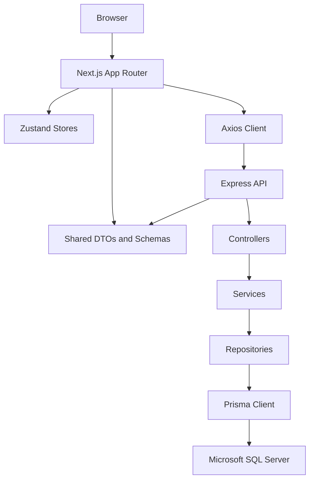
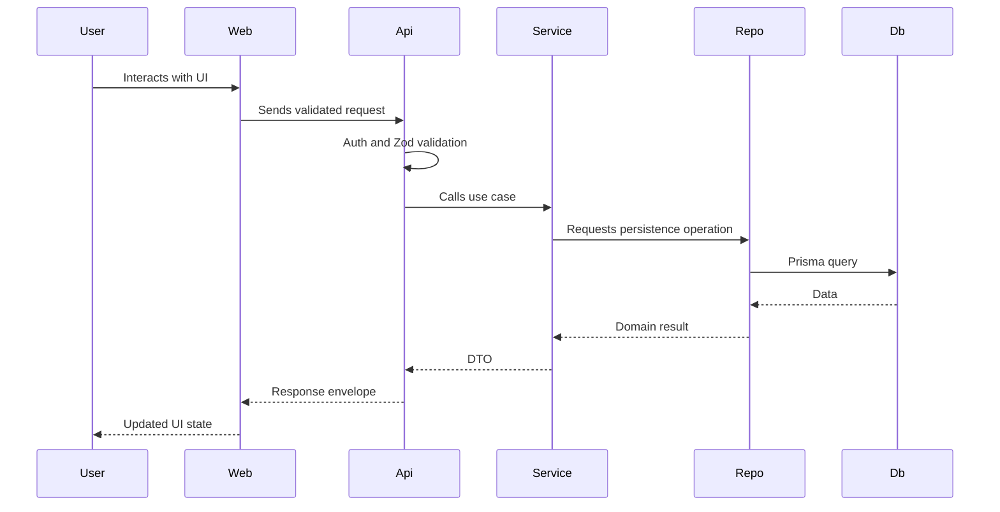
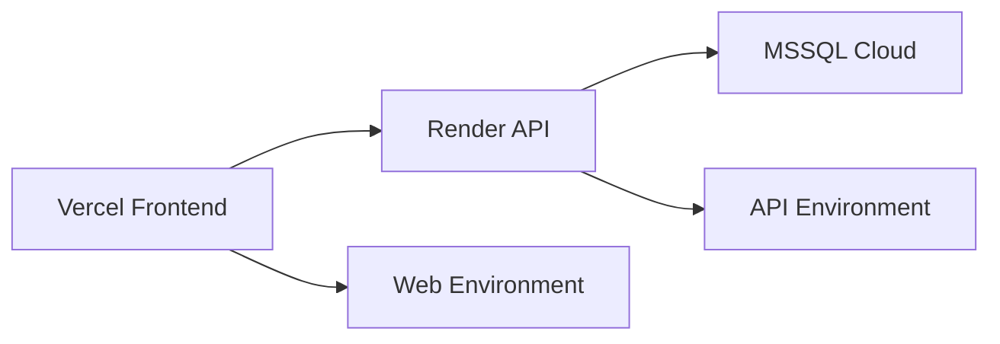

# Flux Architecture

## Overview

Flux uses a clean monorepo architecture. The web application owns presentation and client state. The API owns business workflows, security, validation, and persistence. The shared package owns contracts that are safe to use on both sides.



## Monorepo Boundaries

### `apps/web`

Responsibilities:

- Routes and layouts.
- UI components.
- Feature components.
- Client-side stores.
- API client calls.
- SEO metadata.
- PWA assets.

Rules:

- Must not import backend internals.
- Must not access Prisma or database code.
- Should import shared contracts from `@flux/shared`.
- Should keep business calculations small and presentation-focused.

### `apps/api`

Responsibilities:

- HTTP API.
- Authentication and authorization.
- Request validation.
- Business services.
- Persistence repositories.
- Prisma schema, migrations, and seed data.

Rules:

- Controllers map HTTP requests to services.
- Services hold business rules.
- Repositories hold Prisma queries.
- API responses must follow the shared response envelope.
- Security and validation are enforced before service execution.

### `packages/shared`

Responsibilities:

- Shared TypeScript types.
- Zod schemas.
- DTOs.
- Constants.
- API response helpers.

Rules:

- Must be environment-agnostic.
- Must not import React, Express, Prisma, or Node-only modules.
- Must be safe for browser and server usage.

## Frontend Structure

Planned structure:

```text
apps/web/src
  app/
  components/
    layout/
    ui/
  features/
    admin/
    auth/
    cart/
    catalog/
    checkout/
    compare/
    home/
    products/
    recommendations/
    wishlist/
  lib/
    api/
    constants/
    motion/
    utils/
  stores/
  styles/
```

## Backend Structure

Planned structure:

```text
apps/api/src
  config/
  modules/
    auth/
    cart/
    categories/
    orders/
    products/
    recommendations/
    reviews/
    users/
  shared/
    errors/
    middleware/
    prisma/
    utils/
  app.ts
  server.ts
```

Each module follows:

```text
module-name/
  module.controller.ts
  module.routes.ts
  module.service.ts
  module.repository.ts
  module.schemas.ts
  module.types.ts
```

## Data Flow



## API Response Envelope

All API responses use a predictable shape:

```ts
export type ApiResponse<T> = {
  success: boolean;
  data?: T;
  error?: {
    code: string;
    message: string;
    details?: unknown;
  };
  meta?: {
    page?: number;
    pageSize?: number;
    total?: number;
  };
};
```

## Database Model Areas

Core entities:

- Users and roles.
- Products, categories, images, specifications.
- Reviews and ratings.
- Cart and cart items.
- Favorites.
- Orders and order items.
- Notifications.
- Refresh tokens.

Design rules:

- Use explicit relations.
- Add indexes for filtering and lookup paths.
- Use decimal prices.
- Keep product specifications flexible enough for electronics.
- Avoid database-specific assumptions outside the Prisma layer.

## Security Model

- Passwords are hashed with bcrypt.
- Access tokens are short-lived JWTs.
- Refresh tokens are stored server-side and can be revoked.
- Admin endpoints require role checks.
- Validation runs before service calls.
- Sensitive configuration lives in environment variables.

## Deployment Model



Frontend target:

- Vercel.
- Next.js production build.
- Environment variable for API base URL.

Backend target:

- Render.
- Node.js service.
- Environment variables for JWT, CORS, and database URL.

Database target:

- Microsoft SQL Server cloud hosting.
- Prisma migrations and seed scripts.
